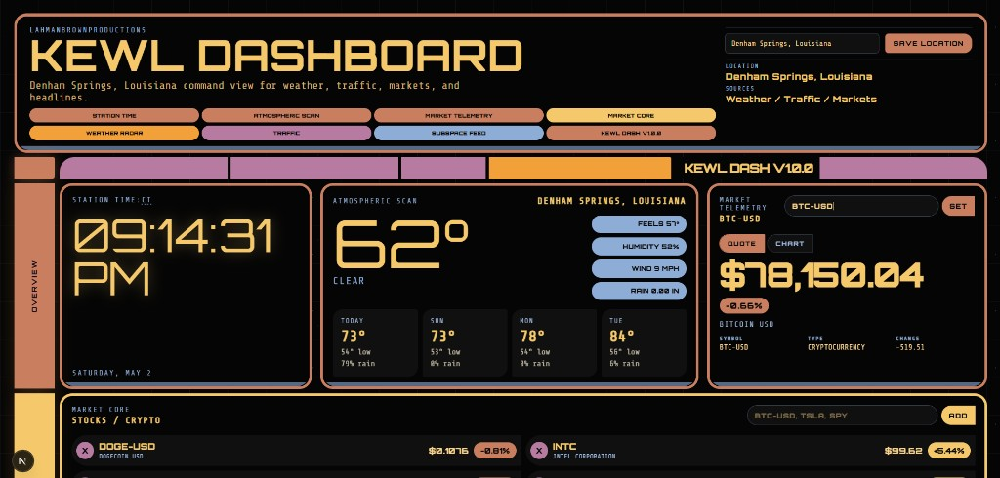

# kewldashboard

Chad and Nick's LCARS-inspired command dashboard: weather, traffic, markets, and RSS headlines for your chosen location.

## Screenshot



## Development

```bash
npm install
npm run dev
```

```bash
npm run build
npm start
```

```bash
npm run typecheck
```
